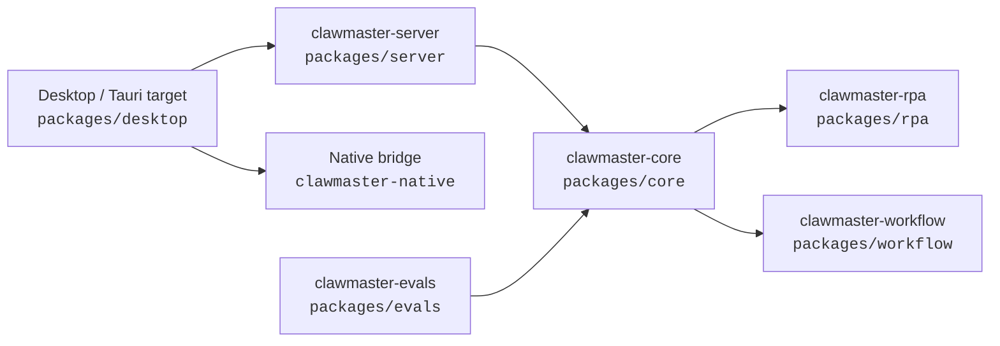
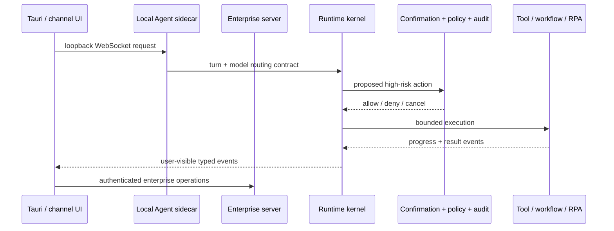
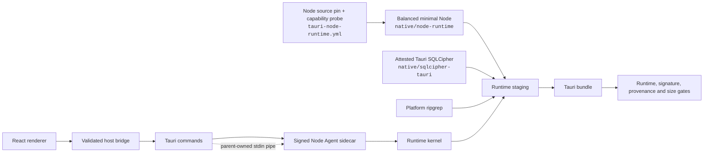
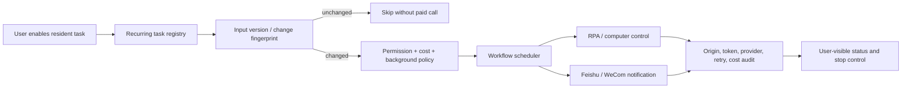

# ClawMaster code map

> Generated by `npm run code-map`. Do not hand-edit generated workspace edges.
> Start here, then use [runtime-kernel-boundary.md](runtime-kernel-boundary.md) for ownership decisions.

## Workspace topology

Arrows mean “imports or depends on”. The runtime kernel does not depend on Desktop or Server product surfaces.

## Interactive request path

## Tauri product path

The Electron main/preload tree is a temporary compatibility baseline. New desktop capabilities target Tauri and must not silently depend on ignored Electron build output.

## Resident work, scheduling, and RPA

## Fast lookup

| Need | Start here | Boundary / evidence |
| --- | --- | --- |
| Turn lifecycle, tool state, confirmation, audit | `packages/core` | `docs/runtime-kernel-boundary.md` |
| Enterprise APIs, tenancy, channels | `packages/server` | Server focused tests |
| GUI and native desktop capabilities | `packages/desktop/src/renderer`, `packages/desktop/src-tauri` | Desktop and Cargo tests |
| Tauri runtime provenance | `packages/desktop/scripts/prepare-tauri-runtime.mjs`, `native/node-runtime` | pinned Node source/ABI, capability probe, SQLCipher verifier, runtime smoke, and bundle verifier |
| Long-running schedules | `packages/workflow` | workflow tests and recurring registry |
| Computer control | `packages/rpa` | RPA policy and adapter tests |

## Update triggers

Regenerate this map when workspace dependencies, runtime ownership, background execution, channels, customer modules, Tauri runtime packaging, signing, size gates, or release topology change.
