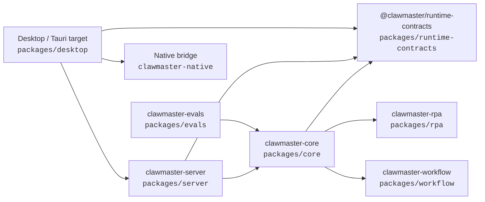
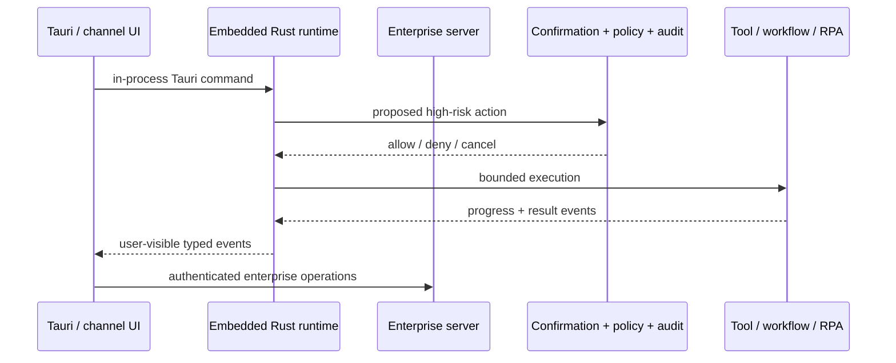
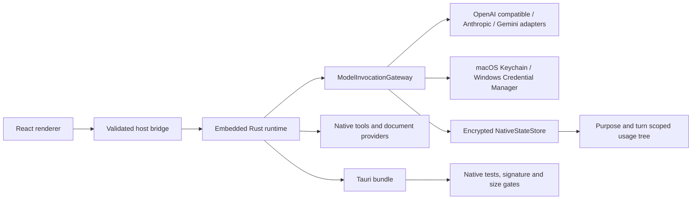
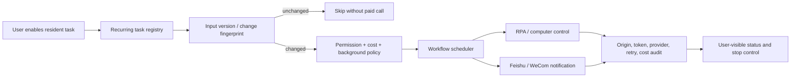

# ClawMaster code map

> Generated by `npm run code-map`. Do not hand-edit generated workspace edges.
> Start here, then use [runtime-kernel-boundary.md](runtime-kernel-boundary.md) for ownership decisions.

## Workspace topology

Arrows mean “imports or depends on”. The runtime kernel does not depend on Desktop or Server product surfaces.

## Interactive request path

## Tauri product path

The Electron main/preload tree is a temporary compatibility baseline. New desktop capabilities target Tauri and must not silently depend on ignored Electron build output.

## Resident work, scheduling, and RPA

## Fast lookup

| Need | Start here | Boundary / evidence |
| --- | --- | --- |
| Turn lifecycle, tool state, confirmation, audit | `packages/core` | `docs/runtime-kernel-boundary.md` |
| Enterprise APIs, tenancy, channels | `packages/server` | Server focused tests |
| GUI and native desktop capabilities | `packages/desktop/src/renderer`, `packages/desktop/src-tauri` | Desktop and Cargo tests |
| Native model invocation, credentials, retry, cancellation, usage | `packages/desktop/src-tauri/src/native_model_gateway.rs` | Recorded provider fixtures and `npm run validate:boundaries` |
| Encrypted sessions, messages, knowledge, checkpoints, usage, artifacts | `packages/desktop/src-tauri/src/native_state_store.rs`, `packages/desktop/src-tauri/src/native_encrypted_checkpoints.rs` | Native StateStore/runtime tests and ownership validator |
| Tauri runtime provenance | `packages/desktop/src-tauri`, `.github/workflows/tauri-preview.yml` | Rust-native tests, legacy-runtime rejection, artifact size gate, and packaged smoke |
| Long-running schedules | `packages/workflow` | workflow tests and recurring registry |
| Computer control | `packages/rpa` | RPA policy and adapter tests |

## Update triggers

Regenerate this map when workspace dependencies, runtime ownership, background execution, channels, customer modules, Tauri runtime packaging, signing, size gates, or release topology change.
